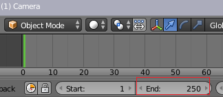

## Keyframing

With a stop frame animation (also known as "stop motion") you have to create all of the frames by yourself.

**Keyframing** animation takes particular images at certain times in a movie and asks the computer to work out all the other images in between. For example, if the car starts at its current position and 4 seconds later it should be next to the snowman, the computer will work out a way of driving the car from the starting position to the snowman - you don't have to create all the frames by yourself.

At the bottom of Blender there is a timeline (with a green bar).

At the moment you have 250 frames which means 250 images will be output by the computer for the animation. There are 24 frames in 1 second, so that's slightly more than 10 seconds of animation. For this project, you only want just over 4 seconds worth of animation, so let's set the end frame to 100.

+ Locate the box for **End frame** at the bottom of the screen

+ Set the **End frame** by typing 100 in the box, then press <kbd>Enter</kbd>.
